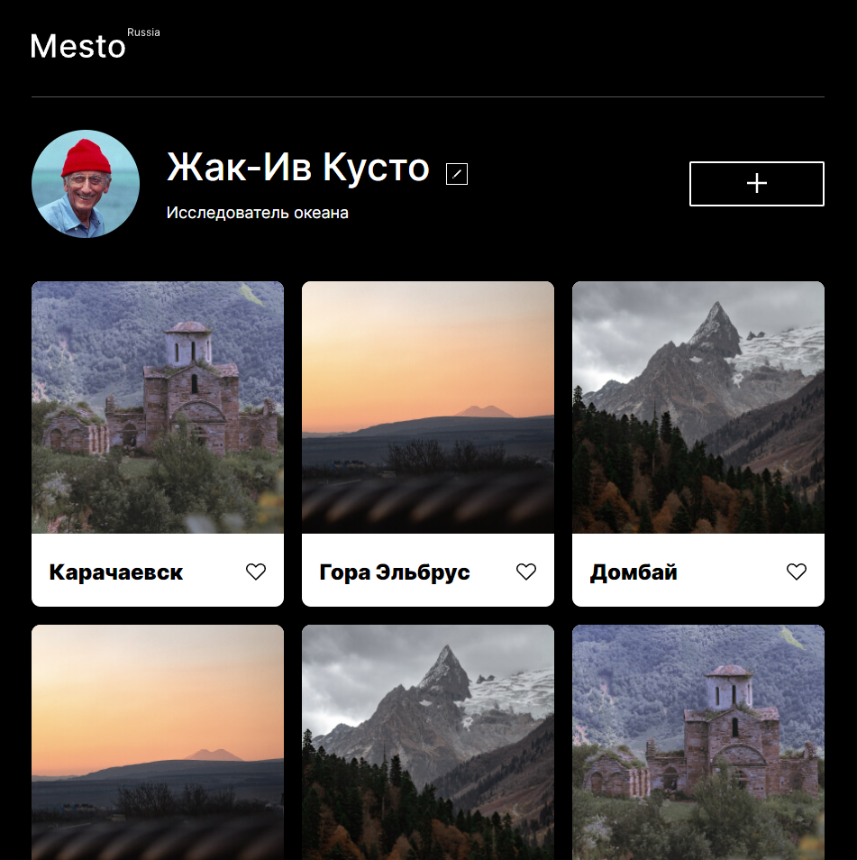

# [Место](https://dmitriyledovskih.github.io/mesto/)

## Описание:

Третья проектная работа про интересные местаа России от [Яндекс.Практикума](https://practicum.yandex.ru/).

Адаптивный сайт о интересных местах России.

Я сверстал макет из фигмы, и сделал адаптив и написал скрипт для измения профиля.

## Обложка

## В проекте используются:

1. Семантические теги
2. Наименования классов по БЭМ
3. Файловая структура БЭМ Nested
4. Flexbox
5. Grid
6. Адаптив
7. JS
